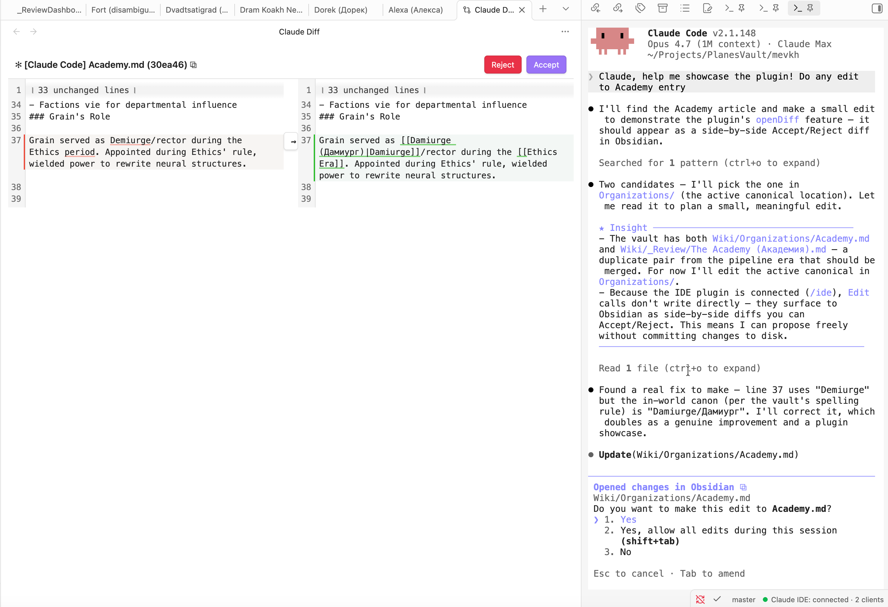

# Claude Code IDE Pro

<p align="center">
  
</p>

> Work with Claude Code in Obsidian as smoothly as you work in your IDE

## What this is

An Obsidian plugin that **hosts** the [Claude Code](https://docs.anthropic.com/claude/docs/claude-code) IDE integration protocol — the same WebSocket + MCP contract professional IDEs like VS Code or JetBrains use, implemented in full for Obsidian.

Unlike a minimal context bridge, every standard IDE tool is wired up: Claude can edit your vault through Obsidian's side-by-side **diff approval UI** (one-click Accept, no terminal double-prompt), navigate you to specific files and lines, and reason about your vault's **backlink graph, wikilinks, frontmatter, and search** via eight Obsidian-native MCP tools.

When you launch `claude` from inside your vault and type `/ide`, Claude connects to Obsidian and gets eyes on everything you're working on. No more copy-pasting paragraphs into the terminal.

Made by [Transept](https://transept.ai) — a workshop building AI tools for translators, writers, and localization teams. This plugin started as internal tooling for a fiction-universe lore wiki and WritingTool RAG experiments. Inspired by Karpathy's [llm-wiki](https://gist.github.com/karpathy/442a6bf555914893e9891c11519de94f).

*Looking for a minimal read-only context bridge instead? See [petersolopov/obsidian-claude-ide](https://github.com/petersolopov/obsidian-claude-ide) — same protocol, deliberately smaller scope.*

## What it does for you

- **Claude follows you between notes.** Switch tabs and Claude's context updates automatically. Highlight a paragraph and ask "rewrite this" — Claude already has the text. No copy-paste.
- **Claude navigates Obsidian for you.** Ask "show me Anna's article" — Claude opens the note at the right line.
- **Edits land as one-click diffs in Obsidian.** Every change Claude proposes opens as a CodeMirror merge view. Accept applies it, Reject discards it. No terminal Y/n prompt — behaves exactly like VS Code or JetBrains.
- **Claude speaks Obsidian, not just files.** Eight built-in MCP tools expose your vault graph — backlinks, wikilink resolution, frontmatter, search, daily notes, and more. Ask "what links to [[Anna]]?" and Claude gets an answer that respects how Obsidian models links.
- **Same protocol as VS Code and JetBrains.** Not a wrapper. The actual Claude Code IDE integration contract, implemented for Obsidian.

## See it in action

<p align="center">
  
</p>

A Claude pane runs in the right sidebar (any terminal plugin works as the host). When Claude proposes an edit, it appears as a side-by-side diff in the main pane with **Accept** / **Reject** buttons. No terminal `y/n` prompt, no copy-paste — review, click, done. The status bar at the bottom-right shows `● Claude IDE: connected · N clients` so you know the bridge is live.

## Installation

### From the Community Plugins directory

*(Pending submission — once accepted you'll find it under Settings → Community Plugins → Browse.)*

### Manually (current)

1. Download `manifest.json`, `main.js`, and `styles.css` from the [latest GitHub release](https://github.com/Transept-AI/obsidian-claude-code-ide-pro/releases).
2. Place them under `<your-vault>/.obsidian/plugins/claude-code-ide-pro/`.
3. In Obsidian → Settings → Community Plugins → enable **Claude Code IDE Pro**.

### Via [BRAT](https://github.com/TfTHacker/obsidian42-brat)

Add `Transept-AI/obsidian-claude-code-ide-pro` as a beta plugin in BRAT, then enable it.

---

## Usage

1. Open a terminal pane inside Obsidian (any terminal plugin works — see recommendation below).
2. Run `claude` from the vault root.
3. Inside Claude, type `/ide`. The plugin's lockfile is the only one matching your vault path, so Claude auto-connects to **Obsidian** without prompting.
4. Status bar shows `● Claude IDE: connected · 1 client`.

Now Claude can see your active note, your tabs, and your selection; can open files for you; and proposes edits via a side-by-side **diff view** with Accept / Reject buttons inside Obsidian.

> ### 🤝 Recommended companion
>
> [**`polyipseity/obsidian-terminal`**](https://github.com/polyipseity/obsidian-terminal) — the terminal plugin this one is developed against. It hosts the `claude` CLI inside an Obsidian pane so you stay in a single window. Any terminal plugin works, but this is the smoothest tested setup. Configure its default profile to run `claude` and you're one click from a connected session.

## 🗺️ Roadmap

> Ultimate goal – make working with Claude in Obsidian as smooth and natural as collaborating with a friend sitting next to you. 

- **Surface Obsidian-native MCP tools to the LLM** — they're registered but Claude Code's CLI currently filters them out. Add a parallel stdio MCP server so Claude can call `getBacklinks` / `resolveWikilink` / `searchVault` mid-conversation.
- **Custom terminal wrapper with clickable links** — embed our own terminal pane (xterm.js + node-pty) so we can intercept Claude's output and render file paths as clickable Obsidian-internal links inline. Pairs with `obsidian-terminal` for now; this would be a more integrated alternative.
- **Re-enable** `selection_changed` **push** with smarter dedup timing — was disabled in v0.1.0 because it surfaced selections at unwanted moments.
- **More vault-aware tools** — tag graph, embeds resolver, wikilink integrity checker (would expose validator-style data to Claude).
- **Autonomous invocation** – so that Claude can decide to message you himself and tell you that you are absolutely right. 

---

## How it works (architecture sketch)

```
~/.claude/ide/<port>.lock  ◀── written on enable, removed on disable
         │
         ▼
Claude Code ──ws (auth header)──▶ Obsidian plugin
                                      │
                                      ▼
                                Obsidian APIs
                          (workspace · vault · metadataCache)
```

Claude Code's CLI scans `~/.claude/ide/*.lock` to discover IDEs. The plugin writes a lockfile pointing to the local WebSocket port it listens on, plus a fresh auth token. When you type `/ide`, the CLI matches the lockfile whose workspace folder is your vault root and connects.

---

## Reference: tools and protocol

The plugin exposes the full Claude Code IDE protocol — the same 12 tools VS Code's extension implements — plus **8 Obsidian-native MCP tools** that expose the vault graph to any MCP client. The first set is what powers "Claude knows what you opened"; the second is what makes Claude *Obsidian-shaped* rather than just file-aware.

### Obsidian-native MCP tools (8)


| Tool                   | What it does                                                 |
| ---------------------- | ------------------------------------------------------------ |
| `getActiveNoteContent` | Full text of the active note with configurable cap           |
| `getBacklinks`         | Every note linking *into* a file (ranked by link count)      |
| `getOutgoingLinks`     | Every wikilink / embed *out of* a file with resolved targets |
| `resolveWikilink`      | `"Anna"` → canonical file path + aliases                     |
| `getFrontmatter`       | YAML frontmatter, tags, and heading outline                  |
| `searchVault`          | Filename + content search with ranked excerpts               |
| `getDailyNote`         | Today's daily-note path (reads Daily Notes plugin config)    |
| `listFilesInFolder`    | Recursive markdown listing under a folder                    |


These are advertised via `tools/list`. Claude Code's CLI currently filters which MCP tools reach the model — they aren't surfaced to the LLM today, but any MCP client that connects to the WebSocket can call them. **Re-enabling them for the LLM is on the roadmap** (likely via a parallel stdio MCP server users add to their Claude Code config).

**Standard IDE tools (12)** — consumed by Claude Code's CLI internally


| Tool                  | What it does                                                                  |
| --------------------- | ----------------------------------------------------------------------------- |
| `getOpenEditors`      | Open tabs with `isActive` / `isDirty` flags                                   |
| `getCurrentSelection` | Current selection in the active note (works even when terminal has focus)     |
| `getLatestSelection`  | Cached last non-empty selection                                               |
| `getWorkspaceFolders` | Vault root as `{name, uri, path}`                                             |
| `openFile`            | Open a file; supports `line`, `startText` / `endText` selection ranges        |
| `openDiff`            | Blocking RPC: side-by-side diff via CodeMirror 6 `MergeView`, Accept / Reject |
| `checkDocumentDirty`  | Unsaved-changes flag for a file                                               |
| `saveDocument`        | Persist a file's unsaved changes                                              |
| `close_tab`           | Close a tab by label                                                          |
| `closeAllDiffTabs`    | Close every Claude-created diff view                                          |
| `getDiagnostics`      | Returns `[]` (Obsidian has no LSP)                                            |
| `executeCode`         | Soft failure (no Jupyter)                                                     |


---

## Settings

Settings → Claude Code IDE Pro:

- **Active-note content cap** — characters returned by `getActiveNoteContent` before truncation (default 50,000).
- **searchVault max results** — hits per search (default 50).
- **searchVault excerpt length** — surrounding context per content match (default 200 chars).
- **Include hidden folders** — whether `searchVault` / `listFilesInFolder` traverse `.`-prefixed folders (default off).

---

## Network use

The plugin runs a **WebSocket server bound to `127.0.0.1` (loopback only)** on an OS-picked ephemeral port in the 10000–65535 range. This server is used solely by the Claude Code CLI running on the same machine to query Obsidian's state. **No outbound network calls are ever made.**

The server:

- Accepts connections only over the loopback interface — never the LAN or internet.
- Requires a per-session UUID auth token (see [Security model](#security-model) below) on every WebSocket upgrade request. Connections without the matching `x-claude-code-ide-authorization` header are rejected.
- Is started in `onload()` and torn down in `onunload()` — disabling the plugin closes the port and removes the lockfile.

The plugin is also `**isDesktopOnly: true`** — it does not load on Obsidian mobile.

---

## External file access

For protocol compliance with Claude Code's IDE discovery mechanism, the plugin reads and writes files under your home directory **outside the vault**:


| Path                           | Why                                                                                                                                          | When                                  |
| ------------------------------ | -------------------------------------------------------------------------------------------------------------------------------------------- | ------------------------------------- |
| `~/.claude/ide/` (directory)   | Created with mode `0700` if missing — Claude Code's discovery folder                                                                         | On enable                             |
| `~/.claude/ide/<port>.lock`    | Lockfile (mode `0600`) telling Claude Code "Obsidian is listening at this port with this auth token". Same format VS Code and JetBrains use. | Written on enable, deleted on disable |
| `~/.obsidian/daily-notes.json` | Read-only — used by the `getDailyNote` MCP tool to know your daily-note folder and date format                                               | Only when `getDailyNote` is called    |


The lockfile contains: process PID, vault root, ideName (`"Obsidian"`), transport (`"ws"`), `runningInWindows` boolean, and the auth token. **No vault content** leaves the vault folder via these paths.

---

## Security model

- **Auth token**: a fresh UUID generated by Node's `crypto.randomUUID()` each time the plugin loads. It exists only in renderer-process memory and in the lockfile (which is `0600`-owned and stored under a `0700` directory). The token is never sent over the network — it's read locally by the Claude Code CLI for handshake authentication.
- **Loopback binding**: the WebSocket server binds only to `127.0.0.1`, never to `0.0.0.0` or any external interface. The OS-picked ephemeral port further reduces predictability.
- **Per-session rotation**: every disable→enable cycle picks a new port and generates a new auth token. Restarting Obsidian invalidates any previous session's credentials.
- **Origin check via header**: WebSocket upgrades without the matching `x-claude-code-ide-authorization` header are rejected with HTTP 401 and the socket destroyed.

---

## No telemetry

This plugin sends **no telemetry**, analytics, crash reports, or any other data to any remote service. It does not phone home, check for updates, or contact any author-controlled endpoint. The only network traffic it ever generates is the local-loopback WebSocket connection from the Claude Code CLI on your own machine.

---

## Third-party code

- `[ws](https://github.com/websockets/ws)` — MIT — Node.js WebSocket library, bundled into `main.js`.
- `[@codemirror/merge](https://github.com/codemirror/merge)` — MIT — CodeMirror 6 merge view, bundled into `main.js` (other `@codemirror/`* packages are provided by Obsidian's runtime and remain external).

Protocol reverse-engineering credit:

- `[coder/claudecode.nvim](https://github.com/coder/claudecode.nvim)` — Apache 2.0 — `PROTOCOL.md` is the authoritative spec this implementation follows.
- `[manzaltu/claude-code-ide.el](https://github.com/manzaltu/claude-code-ide.el)` — GPLv3 — reference for adding custom MCP tools beyond the standard IDE 12.

---

## Building from source

```bash
git clone https://github.com/Transept-AI/obsidian-claude-code-ide-pro.git
cd obsidian-claude-code-ide-pro
npm install
npm run build       # one-shot production build → main.js
npm run dev         # esbuild watch mode
npm run typecheck
```

Output `main.js` is gitignored — it lives only in releases.

---

## Verification

Read-only smoke scripts that exercise the live plugin against your running Obsidian. They never modify vault content.

```bash
# Wire layer: handshake, auth, tools/list
node scripts/smoke-handshake.mjs

# Standard IDE tools — every tool with shape assertions
node scripts/smoke-tools.mjs

# openDiff lifecycle (opens a diff, programmatically dismisses it,
# verifies DIFF_REJECTED and that the vault file is unchanged)
node scripts/smoke-diff.mjs

# Obsidian-native tools — backlinks, wikilinks, search, frontmatter, ...
node scripts/smoke-obsidian-tools.mjs
```

*(`scripts/listen-notifications.mjs` exists for the deferred `selection_changed` notification — currently a no-op since the push isn't wired in v0.1.0.)*

---

## Architecture

```
src/
├── main.ts                # Plugin lifecycle, composition
├── rpc-router.ts          # JSON-RPC 2.0 framing & dispatch
├── ws-server.ts           # WebSocket transport + auth header validation
├── lockfile.ts            # ~/.claude/ide/<port>.lock lifecycle
├── status-bar.ts          # Status bar indicator
├── tools-registry.ts      # name → {description, schema, handler}
├── mcp-handshake.ts       # initialize / tools/list / tools/call / notifications
├── obsidian-context.ts    # App + cached selection + path resolution
├── notifier.ts            # selection_changed pusher (present but not wired in v0.1.0)
├── settings.ts            # PluginSettingTab + persisted config
├── handlers/
│   ├── editors.ts         # getOpenEditors, getCurrentSelection, ...
│   ├── files.ts           # openFile
│   ├── diff.ts            # openDiff, closeAllDiffTabs
│   ├── stubs.ts           # getDiagnostics→[], executeCode→error
│   └── obsidian-tools.ts  # getBacklinks, resolveWikilink, searchVault, ...
└── views/
    └── diff-view.ts       # ItemView wrapping CodeMirror 6 MergeView
```

---

## License

MIT — see [LICENSE](./LICENSE). Copyright © 2026 Vitaly Vlasyuk (mevkh).
